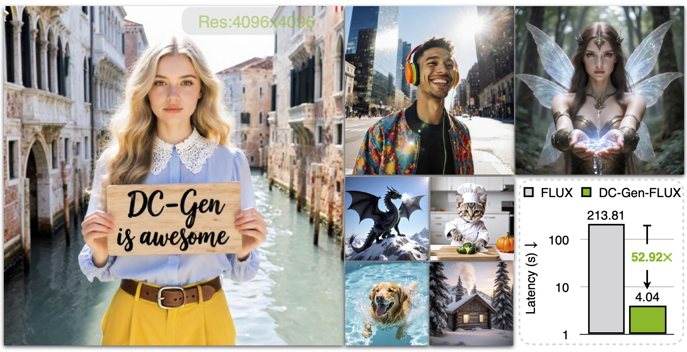
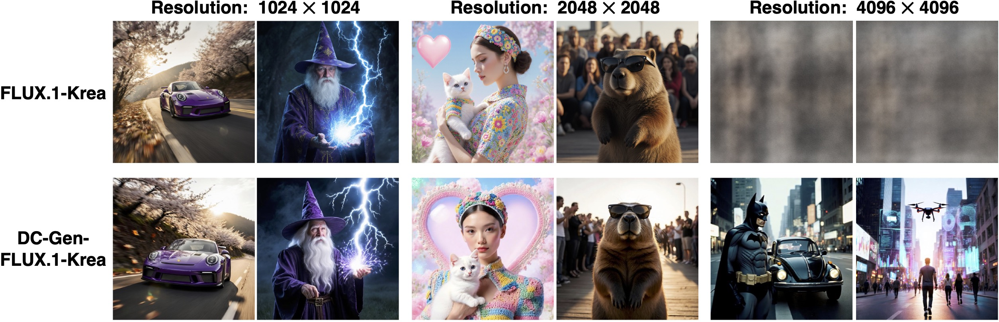
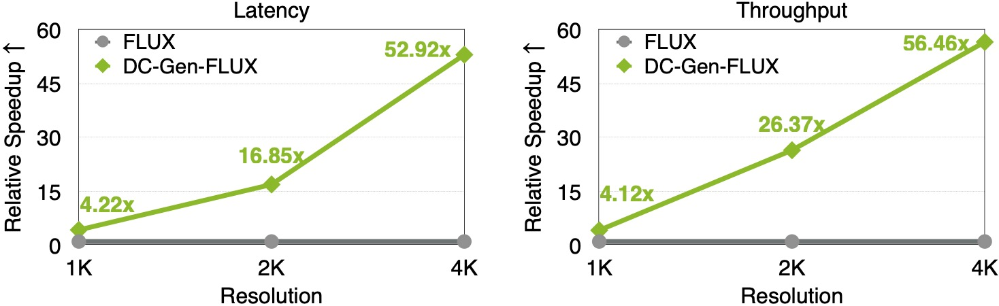
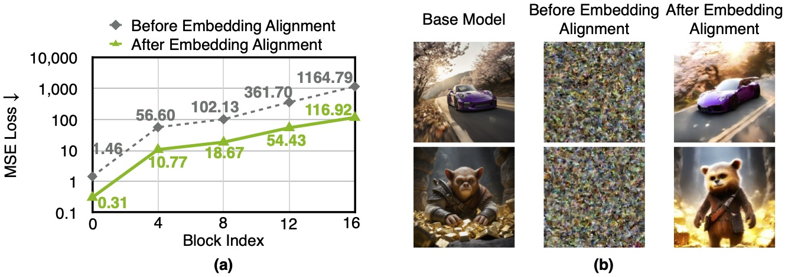
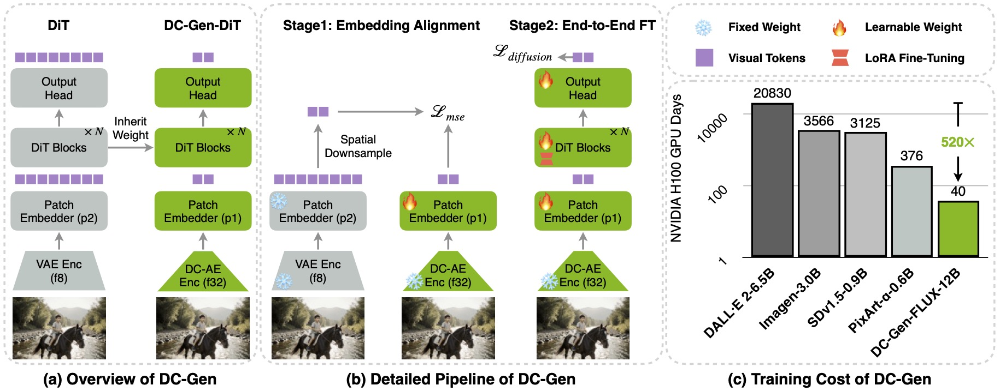

# DC-Gen: Post-Training Diffusion Acceleration with Deeply Compressed Latent Space

<div align="center">
  <a href="https://hanlab.mit.edu/projects/dc-gen/"></a> &ensp;
  <a href="https://arxiv.org/abs/2509.25180"></a> &ensp;
  <!-- <a href="https://huggingface.co/collections/dc-ai/dc-gen-6899bb095082244f396203e1"></a> &ensp; -->
</div>

<p align="center" border-radius="10px">
  
</p>

## 🔥🔥 News
- (🔥 New) \[2025/9/30\] We released the [DC-Gen technical report](https://arxiv.org/abs/2509.25180) on arXiv.
- (🔥 New) \[2025/9/30\] We released [DC-AE-Lite](projects/DC-AE-Lite.md). 
- \[2025/6\] DC-AE 1.5 is accepted by ICCV 2025!

## 💡 Introduction
DC-Gen is a new acceleration framework for diffusion models. DC-Gen works with any pre-trained diffusion model, boosting efficiency by transferring it into a deeply compressed latent space with lightweight post-training. For example, applying DC-Gen to FLUX.1-Krea-12B takes just 40 H100 GPU days. The resulting DC-Gen-FLUX delivers the same quality as the base model while achieving dramatic gains—53× faster inference on H100 at 4K resolution. And when paired with NVFP4, DC-Gen-FLUX (20 sampling steps) generates a 4K image in only 3.5 seconds on a single NVIDIA 5090 GPU, a total latency reduction of 138× compared to the base FLUX.1-Krea model.

### Highlight 1: DC-Gen Enables Native High-Resolution Image Generation with Exceptional Efficiency

- <ins>FLUX does not support 4K image generation due to prohibitive training and inference costs. DC-Gen-FLUX addresses this limitation by reducing token redundancy with [DC-AE-f64c128](projects/DC-AE.md).</ins>
<figure>
  
</figure>

- <ins>DC-Gen-FLUX achieves approximately 53× latency reduction and a 56× throughput improvement over the base model at 4K resolution on H100.</ins>
<figure>
  
</figure>

### Highlight 2: DC-Gen Maintains Base Model Quality

FLUX.1-Krea is recognized for its superior realism and text-rendering capabilities but suffers from lower throughput. DC-Gen-FLUX successfully preserves these qualities while delivering a significant speedup over FLUX.1-Krea, achieving the highest throughput among the models compared.

- <ins>Comparison to Previous Models on 1024×1024 Resolution.</ins>
<figure>
  
</figure>

### Highlight 3: DC-Gen Facilitates Rapid Autoencoder Adaptation

Previously, changing the autoencoder required retraining diffusion models from scratch, which was highly inefficient. DC-Gen introduces **Embedding Alignment** to transfer the base model’s knowledge to the new latent space. After this alignment, the model can generate images with correct semantics in the new latent space without finetuning the diffusion model’s weights. 

<figure>
  
</figure>

Following embedding alignment, we can fully recover the quality through LoRA finetuning.
<figure>
  
</figure>

## Getting Started

```bash
conda create -n dc_gen python=3.10
conda activate dc_gen
pip install -U -r requirements.txt
```

## Content

### DC-Gen
- The code and pretrained models will be released after the legal review is completed.

### Deep Compression Autoencoder
- [ICLR 2025] DC-AE 1.0: [Getting Started](projects/DC-AE.md), [Website](https://hanlab.mit.edu/projects/dc-ae)
- [ICCV 2025] DC-AE 1.5: [Getting Started](projects/DC-AE-1.5.md), [Website](https://hanlab.mit.edu/projects/dc-ae-1-5), [AE Demo](https://dc-gen.hanlab.ai/), [T2I Demo](https://dc-gen.hanlab.ai/dc_gen_sana_f64c128/)
- DC-AE-Lite: [Getting Started](projects/DC-AE-Lite.md)

## Contact

[Han Cai](http://hancai.ai/)

## Related Projects
- [DC-VideoGen: Efficient Video Generation with Deep Compression Video Autoencoder](https://github.com/dc-ai-projects/DC-VideoGen)

## Reference

```bibtex
@article{he2025dcgen,
 title={DC-Gen: Post-Training Diffusion Acceleration with Deeply Compressed Latent Space},
 author={He, Wenkun and Gu, Yuchao and Chen, Junyu and Zou, Dongyun and Lin, Yujun and Zhang, Zhekai and Xi, Haocheng and Li, Muyang and Zhu, Ligeng and Yu, Jincheng and Chen, Junsong and Xie, Enze and Han, Song and Cai, Han},
 journal={arXiv preprint arXiv:2509.25180},
 year={2025}
}

@article{chen2024deep,
  title={Deep Compression Autoencoder for Efficient High-Resolution Diffusion Models},
  author={Chen, Junyu and Cai, Han and Chen, Junsong and Xie, Enze and Yang, Shang and Tang, Haotian and Li, Muyang and Lu, Yao and Han, Song},
  journal={arXiv preprint arXiv:2410.10733},
  year={2024}
}

@article{chen2025dc,
  title={DC-AE 1.5: Accelerating Diffusion Model Convergence with Structured Latent Space},
  author={Chen, Junyu and Zou, Dongyun and He, Wenkun and Chen, Junsong and Xie, Enze and Han, Song and Cai, Han},
  journal={arXiv preprint arXiv:2508.00413},
  year={2025}
}
```

```bibtex
@misc{zou2025dcaelite,
  title  = {DC-AE-Lite},
  author = {Zou, Dongyun and Chen, Junyu and He, Wenkun and Chen, Junsong and Xie, Enze and Han, Song and Cai, Han},
  url    = {https://github.com/dc-ai-projects/DC-Gen/blob/main/projects/DC-AE-Lite.md},
  month  = Sep,
  year   = {2025}
}
```
