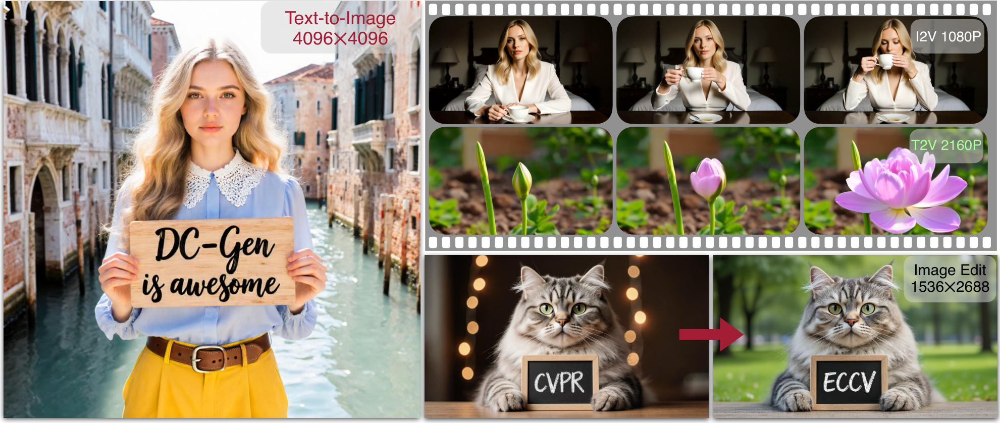
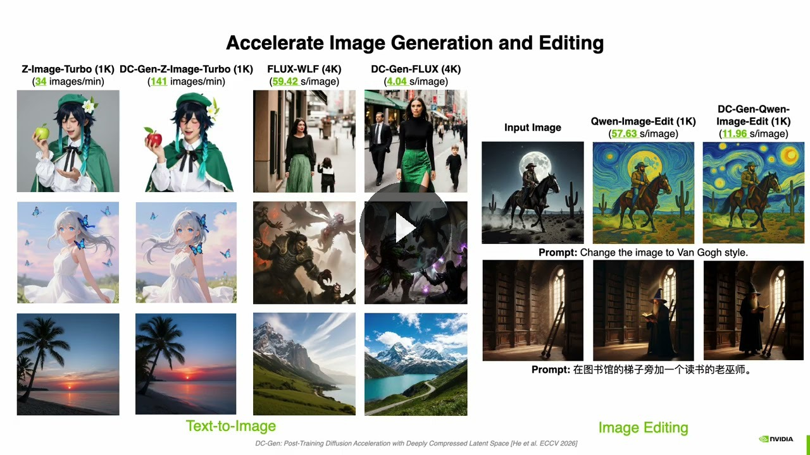
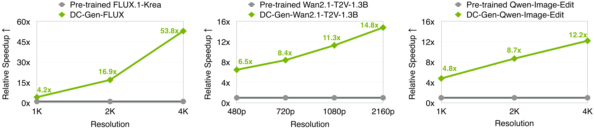
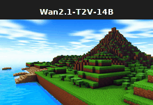
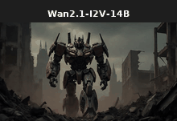
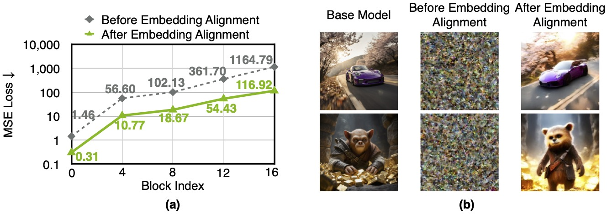
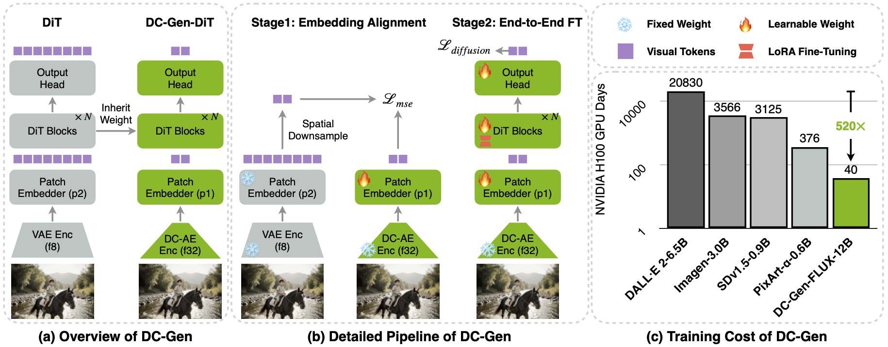

# DC-Gen: Post-Training Diffusion Acceleration with Deeply Compressed Latent Space

<div align="center">
  <a href="https://hanlab.mit.edu/projects/dc-gen/"></a> &ensp;
  <a href="https://arxiv.org/abs/2509.25180"></a> &ensp;
  <!-- <a href="https://huggingface.co/collections/dc-ai/dc-gen-6899bb095082244f396203e1"></a> &ensp; -->
</div>

## 📖 Overview

<p align="center" border-radius="10px">
  
</p>

<p align="center">
  <em>DC-Gen delivers high-quality, high-resolution visual generation across text-to-image, text-to-video, image-to-video, and image editing tasks, achieving up to 53.8× speedup over pre-trained diffusion models.</em>
</p>

## 🎬 Demo

[](https://www.youtube.com/watch?v=gu9KKtJgbho)

## 🔥🔥 News
- (🔥 New) \[2026/6/18\] DC-Gen is accepted by ECCV 2026! 🎉
- (🔥 New) \[2025/9/30\] We released the [DC-Gen technical report](https://arxiv.org/abs/2509.25180) on arXiv.
- (🔥 New) \[2025/9/30\] We released [DC-AE-Lite](projects/DC-AE-Lite.md). 
- \[2025/6\] DC-AE 1.5 is accepted by ICCV 2025!

## 💡 Introduction
DC-Gen is a new acceleration framework for diffusion models. DC-Gen works with any pre-trained diffusion model, boosting efficiency by transferring it into a deeply compressed latent space with lightweight post-training. For example, applying DC-Gen to FLUX.1-Krea takes just 31 H100 GPU days. The resulting DC-Gen-FLUX delivers the same quality as the base model while achieving dramatic gains—53.8× faster inference on H100 at 4K resolution. DC-Gen has been validated across text-to-image, text-to-video, image-to-video, and image editing tasks.

### Highlight 1: DC-Gen Enables Native High-Resolution Image Generation with Exceptional Efficiency

- <ins>FLUX and Z-Image do not support native 4K image generation due to prohibitive training and inference costs. DC-Gen-FLUX and DC-Gen-Z-Image address this limitation by reducing token redundancy with [DC-AE-f64c128](projects/DC-AE.md).</ins>
<figure>
  
</figure>

- <ins>The relative speedup of DC-Gen is more significant at higher resolutions, achieving up to 53.8× acceleration on DC-Gen-FLUX.</ins>
<figure>
  
</figure>

### Highlight 2: DC-Gen Maintains Base Model Quality

Modern visual diffusion models are recognized for their superior realism and text-rendering capabilities but suffer from low throughput. DC-Gen models successfully preserve these qualities while delivering a significant speedup over corresponding base models.

- <ins>Comparison to Previous Models on 1024×1024 Resolution.</ins>
<figure>
  
</figure>

- <ins>Comparison to pre-trained Wan2.1 on 720×1280 Resolution, 81 frames.</ins>

**Text-to-Video**

<table>
<tr>
<td align="center">Wan2.1-T2V-14B<br>(27.52 min/video)</td>
<td align="center">DC-Gen-Wan<br>(3.58 min/video)</td>
<td align="center">Wan2.1-T2V-14B<br>(27.52 min/video)</td>
<td align="center">DC-Gen-Wan<br>(3.58 min/video)</td>
</tr>
<tr>
<td></td>
<td></td>
<td></td>
<td></td>
</tr>
<tr>
<td></td>
<td></td>
<td></td>
<td></td>
</tr>
</table>

**Image-to-Video**

<table>
<tr>
<td align="center">Wan2.1-I2V-14B<br>(27.88 min/video)</td>
<td align="center">DC-Gen-Wan<br>(3.67 min/video)</td>
<td align="center">Wan2.1-I2V-14B<br>(27.88 min/video)</td>
<td align="center">DC-Gen-Wan<br>(3.67 min/video)</td>
</tr>
<tr>
<td></td>
<td></td>
<td></td>
<td></td>
</tr>
<tr>
<td></td>
<td></td>
<td></td>
<td></td>
</tr>
</table>

- <ins>Comparison to pre-trained Qwen-Image-Edit on 1K image editing tasks.</ins>
<figure>
  
</figure>

### Highlight 3: DC-Gen Facilitates Rapid Autoencoder Adaptation

Previously, changing the autoencoder required retraining diffusion models from scratch, which was highly inefficient. DC-Gen introduces **Embedding Alignment** to transfer the base model's knowledge to the new latent space. After this alignment, the model can generate images with correct semantics in the new latent space without finetuning the diffusion model's weights. 

<figure>
  
</figure>

Following embedding alignment, we can fully recover the quality through LoRA finetuning.
<figure>
  
</figure>

## Getting Started

```bash
conda create -n dc_gen python=3.10
conda activate dc_gen
pip install -U -r requirements.txt
```

## Content

### DC-Gen CLI

Run DC-Gen locally with a simple command-line interface. Supports text-to-image (1K and 4K), text-to-video, image-to-video, and instruction-based image editing.

```bash
export HF_TOKEN=<your_hf_token>
python generate.py task=<task> prompt="<text>" save_path=<path> [options]
```

| Task | Description | VAE |
|------|-------------|-----|
| `t2i_1k` | Text-to-image, 1K resolution | DC-AE-f32c32 |
| `t2i_4k` | Text-to-image, 4K resolution | DC-AE-1.5-f64c128 |
| `t2v` | Text-to-video, 720p | DC-AE-V-f32t4c32 |
| `i2v` | Image-to-video, 720p | DC-AE-V-f32t4c32 |
| `edit` | Instruction-based image editing | DC-AE-f32c32 |

**Examples:**

```bash
# Text-to-image 1K
python generate.py task=t2i_1k prompt="A cat lazily lying in a dog's arms in the sun" save_path=out.jpg

# Text-to-image 4K
python generate.py task=t2i_4k prompt="A mountain lake at dawn, mist rising" save_path=out.jpg width=4096 height=4096

# Text-to-video
python generate.py task=t2v prompt="A white cat wearing sunglasses surfs on a wave" save_path=out.mp4

# Image-to-video
python generate.py task=i2v input_image_path=cat.jpg prompt="The cat waves its paw" save_path=out.mp4

# Image editing
python generate.py task=edit input_image_path=photo.jpg prompt="Make the background snowy" save_path=edit.png

# Non-English prompt with auto-expand
python generate.py task=t2i_1k prompt="一只猫慵懒地躺在一只狗的怀里晒太阳。" save_path=out.jpg use_expander=yes
```

Model weights are downloaded automatically on first use from HuggingFace Hub into `pretrained_models/`.

### Deep Compression Autoencoder
- [ICLR 2025] DC-AE 1.0: [Getting Started](projects/DC-AE.md), [Website](https://hanlab.mit.edu/projects/dc-ae)
- [ICCV 2025] DC-AE 1.5: [Getting Started](projects/DC-AE-1.5.md), [Website](https://hanlab.mit.edu/projects/dc-ae-1-5), [AE Demo](https://dc-gen.hanlab.ai/), [T2I Demo](https://dc-gen.hanlab.ai/dc_gen_sana_f64c128/)
- DC-AE-Lite: [Getting Started](projects/DC-AE-Lite.md)

## Contact

[Han Cai](http://hancai.ai/)

## Related Projects
- [DC-VideoGen: Efficient Video Generation with Deep Compression Video Autoencoder](https://github.com/dc-ai-projects/DC-VideoGen)

## Reference

```bibtex
@article{he2025dc,
  title={DC-Gen: Post-Training Diffusion Acceleration with Deeply Compressed Latent Space},
  author={He, Wenkun and Gu, Yuchao and Chen, Junyu and Zou, Dongyun and Lin, Yujun and Zhang, Zhekai and Xi, Haocheng and Li, Muyang and Zhu, Ligeng and Yu, Jincheng and others},
  journal={arXiv preprint arXiv:2509.25180},
  year={2025}
}

@article{chen2024deep,
  title={Deep Compression Autoencoder for Efficient High-Resolution Diffusion Models},
  author={Chen, Junyu and Cai, Han and Chen, Junsong and Xie, Enze and Yang, Shang and Tang, Haotian and Li, Muyang and Lu, Yao and Han, Song},
  journal={arXiv preprint arXiv:2410.10733},
  year={2024}
}

@article{chen2025dc,
  title={DC-AE 1.5: Accelerating Diffusion Model Convergence with Structured Latent Space},
  author={Chen, Junyu and Zou, Dongyun and He, Wenkun and Chen, Junsong and Xie, Enze and Han, Song and Cai, Han},
  journal={arXiv preprint arXiv:2508.00413},
  year={2025}
}
```

```bibtex
@misc{zou2025dcaelite,
  title  = {DC-AE-Lite},
  author = {Zou, Dongyun and Chen, Junyu and He, Wenkun and Chen, Junsong and Xie, Enze and Han, Song and Cai, Han},
  url    = {https://github.com/dc-ai-projects/DC-Gen/blob/main/projects/DC-AE-Lite.md},
  month  = Sep,
  year   = {2025}
}
```
